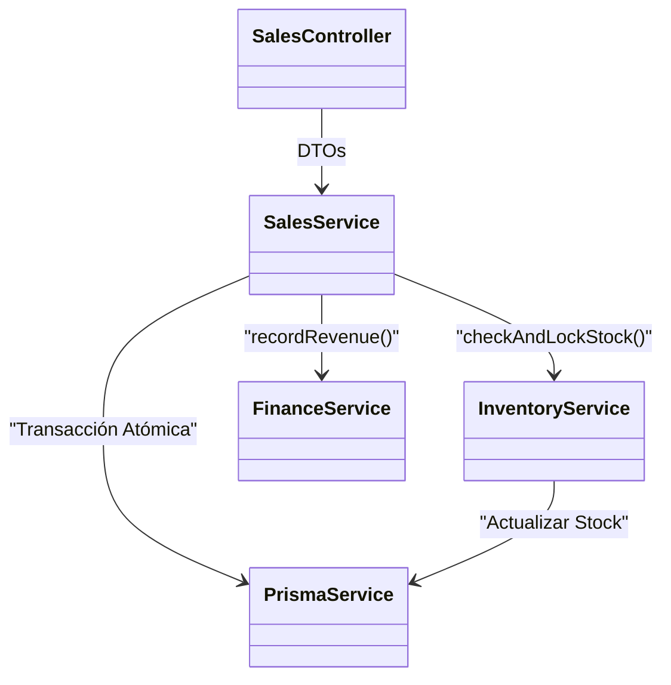

# 🏗️ Trento Core - Arquitectura del Sistema

Este documento proporciona una inmersión técnica profunda en la arquitectura de Trento Core, destinado a Arquitectos, Ingenieros Senior y Auditores.

---

## 1. Resumen Arquitectónico

**Estilo:** Monolito Modular
**Filosofía:** Diseño Guiado por el Dominio (DDD)
**Objetivo Principal:** Consistencia transaccional y simplicidad operativa para venta mayorista/minorista de alto volumen.

### Capas Lógicas Principales

1.  **Capa de Presentación:**
    - **Frontend:** Next.js (SSR/CSR). Actúa como la UI principal.
    - **Telegram Bot:** Interfaz accesible para personal de campo.
2.  **Capa de Aplicación (API Gateway / Controllers):**
    - Maneja peticiones HTTP, validación (DTOs) y guardias de autenticación.
    - Ejemplo: `SalesController`.
3.  **Capa de Servicio de Dominio:**
    - Contiene la lógica de negocio.
    - Ejemplo: `SalesService` calcula totales, `InventoryService` gestiona bloqueos de stock.
4.  **Capa de Persistencia:**
    - **Prisma ORM:** Acceso a base de datos tipado.
    - **PostgreSQL:** Fuente de verdad relacional.

---

## 2. Modelo de Dominio y Entidades Críticas

### Identidad y Acceso
- **User:** Personal interno. Autenticado vía JWT. Vinculado a `TelegramId` para 2FA/Uso de Bot.
- **Role:** Define permisos (ADMIN, USER, SELLER).

### Datos Maestros
- **Product:** Entidad central. Rastreado por `id` (UUID), `sku` (Interno), y `ean` (Código de barras).
- **UnitConversion:** Maneja lógica de empaquetado compleja (ej: 1 Caja = 12 Unidades).
- **Supplier:** Origen de las mercaderías.

### Dominios de Negocio Principales

#### 🛒 Ventas (Sales)
- **Sale:** El registro inmutable de una transacción.
- **SaleItem:** Snapshot del precio/costo del producto al momento de la venta.
- **Flujo de Estado:** `PENDING` -> `PAID` -> `COMPLETED`.
- **Impacto Financiero:** Reconocimiento inmediato de ingresos.

#### 📦 Inventario (Stock)
- **InventoryItem:** Rastrea lote/vencimiento específico en una Ubicación (`locationZone`).
- **InventoryTransaction:** Libro mayor de todos los movimientos de stock.
- **Restricción:** El stock no puede ser negativo (forzado por lógica de aplicación y restricciones de BD donde es posible).

#### 🤝 Mayorista / B2B (Consignaciones)
Un flujo complejo para clientes B2B de alta confianza.
1.  **Quotation (Presupuesto):** Oferta enviada al cliente.
2.  **Consignment (Consignación):** Mercadería entregada pero no facturada. El stock se mueve a "Mano de Cliente".
3.  **Return (Devolución):** Mercadería no vendida devuelta.
4.  **Invoice (Facturación):** Mercadería vendida facturada.

---

## 3. Arquitectura de Servicios

El backend está construido con **NestJS**.

### Módulos Clave
- **SalesModule:** Orquesta el proceso de ventas. Depende de `InventoryModule` para chequeos de stock y `FinanceModule` para registro de ingresos.
- **InventoryModule:** La "Fuente de Verdad" para el stock. Todos los demás módulos DEBEN pasar por `InventoryService` para tocar el stock.
- **AiModule (Cortex):** Integra Google Gemini.
    - **Capacidades:** Generación de SQL en lenguaje natural (consultas seguras de solo lectura), predicción de demanda, generación de descripciones de productos.
    - **Seguridad:** Réplica de solo lectura para análisis pesados.

### Flujo de Dependencias

---

## 4. Flujos Críticos de Negocio

### A. La Transacción de Venta (Atómica)
1.  **Petición:** POS envía carrito.
2.  **Validación:** `SalesService` valida precios y descuentos.
3.  **Bloqueo:** Inicia Transacción BD.
4.  **Chequeo de Inventario:** `InventoryService` decrementa stock. Lanza error si es insuficiente.
5.  **Persistencia:** Se crean `Sale` y `SaleItems`.
6.  **Finanzas:** Se registra entrada de caja si es efectivo.
7.  **Commit:** Transacción finalizada.

### B. Ciclo de Consignación (Máquina de Estados)
`Quotations` -> `Consignment (Active)` -> `Partial Return` -> `Partial Invoice` -> `Closed`

---

## 5. Seguridad y Compliance

### Autenticación
- **JWT:** Firmado con `JWT_SECRET`. Tokens de acceso de vida corta.
- **Contraseñas:** Hasheadas con Bcrypt.

### Autorización (RBAC)
- Decoradores `@Roles('ADMIN')` protegen endpoints sensibles.
- `AuditInterceptor` captura todas las operaciones de escritura en `AuditLog`.

### Integridad Financiera
- **Idempotencia:** Las mutaciones críticas deben buscar headers `idempotency-key` (implementación pendiente).
- **Partida Doble:** Las ventas disparan Inventario(-) y Caja(+).

---

## 6. Riesgos Conocidos y Mitigaciones

| Tipo de Riesgo | Descripción | Mitigación |
| :--- | :--- | :--- |
| **Operativo** | Falla de POS Offline | **Mitigación:** La falta de internet detiene las ventas. *Planeado:* Sincronización offline-first. |
| **Financiero** | Stock Negativo | **Mitigación:** Bloqueos transaccionales. "Forzados" ocasionales logueados en Auditoría. |
| **Seguridad** | Alucinación de IA | **Mitigación:** La IA lee estadísticas pero nunca escribe directamente en tablas transaccionales. |

---

## 7. Estrategia de IA y Datos

- **Modelo:** Google Gemini 1.5 Flash.
- **Integración:** REST API vía `AiService`.
- **Privacidad:** PII (Información Personal Identificable) es eliminada antes de enviar al contexto del LLM donde es posible.
- **Rol:** Asesor. La IA sugiere; los Humanos deciden (Human-in-the-loop).

---
*Generado para Auditoría Enterprise de Trento Core.*
